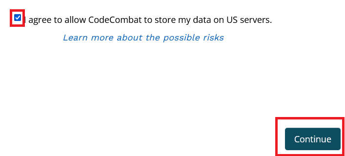

# CodeCombat
## Instructies om in te loggen bij CodeCombat

* Ga naar de CodeCombat website: [https://codecombat.com/](https://codecombat.com/)
* Als de website niet in het Nederlands is, selecteer dan rechtsboven in het scherm Nederlands (Nederland) als taal: 

* Klik op **Ik ben een leerling**: 

* Vul de code in en klik op **Doorgaan**: 

* Zet het vinkje en klik op **Doorgaan**: 

* Vul je voornaam en de eerste letter van je achternaam in, kies een unieke gebruikersnaam en een goed wachtwoord. Onthoud je wachtwoord! Een e-mailadres hoef je niet in te vullen. Klik daarna op **Account maken**: 

* Je kunt nu beginnen met CodeCombat!

## Instructies om in te loggen bij Ozaria

* Ga naar de Ozaria website: [https://ozaria.com/](https://ozaria.com/)
* Deze website is helaas nog niet in het Nederlands beschikbaar.
* Klik op **I'm a Student**: 

* Vul de code in en klik op **Next**: 

* Zet het vinkje en klik op **Continue**: 

* Vul je voornaam en de eerste letter van je achternaam in, kies een unieke gebruikersnaam en een goed wachtwoord. Onthoud je wachtwoord! Een e-mailadres hoef je niet in te vullen. Klik daarna op **Next**: 

* Je kunt nu beginnen met Ozaria!
